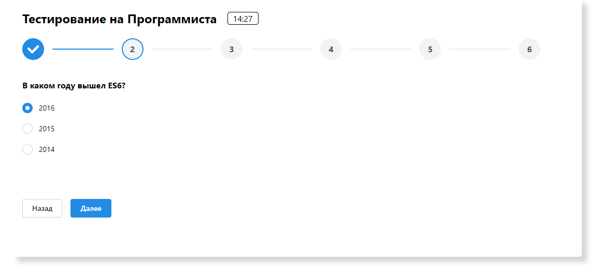
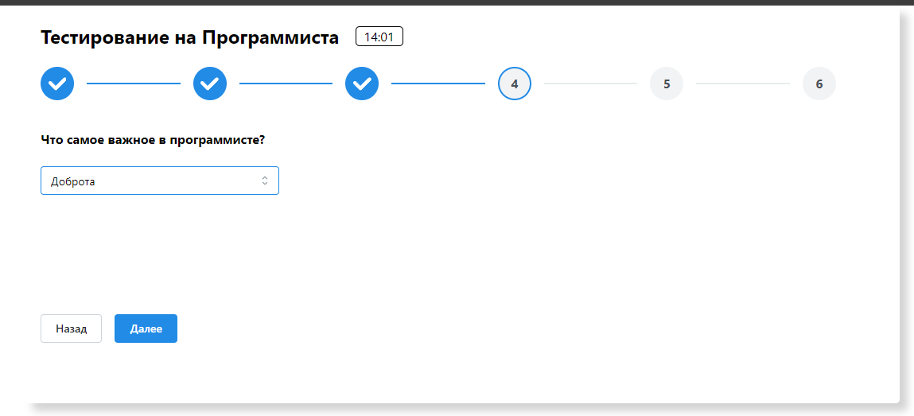
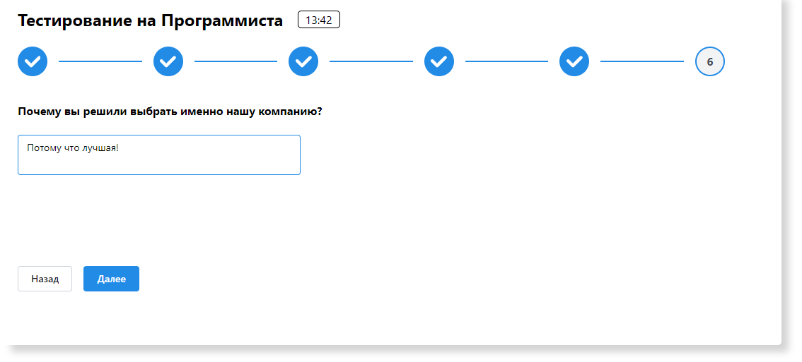
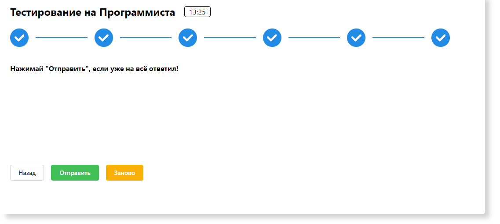
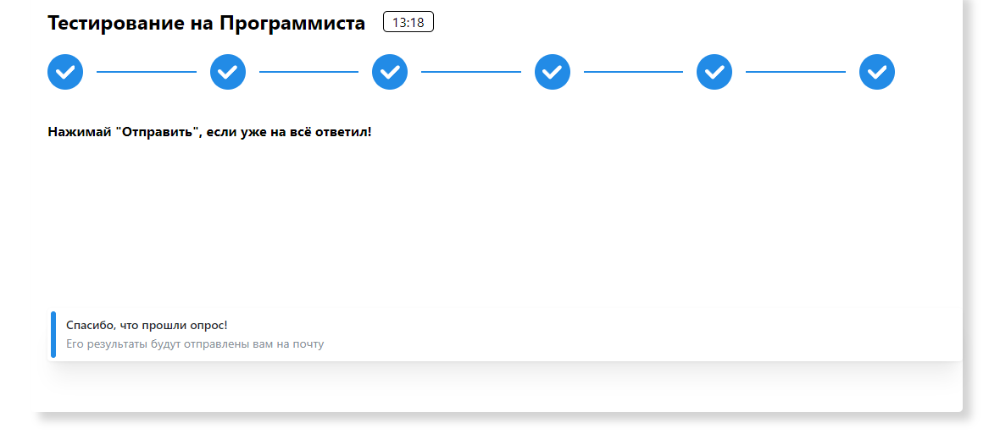

# How to run this project?

## `git clone https://github.com/aftelnes/SurveyInterface.git`

## `cd SurveyInterface`

## `npm install`

## `npm start`

## Как работает данный интерфейс

1. Данный интерфейс является простым опросником.
2. Пользователь должен постепенно выбирать ответ и нажимать "далее", переходя на следующий вопрос.
3. Поля ответов не явлются обязательными.
4. Так же имеется возможность вернуться на несколько вопросов назад и изменить свой ответ.
5. При перезагрузке страницы прогресс выполнения сохраняется (благодаря localStorage).
6. Когда пользователь проходит все ответы у него появляется возможность "Отправить" ответ - в таком случае пропадает возможность взаимодействовать с интерфейсом, а пользователь видит всплывающее окошко, оповещающее его о чём-либо (в данном случае сделана заглушка "ответ отправле на почту"), либо же перепройти тест заново - при нажании на "Заново" страница обоновляется и localStorage очищается.
7. Для добавления новых вопросов в файле Test.tsx стоит добавить элемент <Stepper.Step>, а затем в него компонент с вопросом (так же как это уже сделано). Некоторые вопросы по типу первых 2х требует изменений в файлах questionData.ts и fillLocalStorage.ts. Таким образом для добавления вопрос нужно сделать 3 простых действия.
8. Для изменения таймера, нужно в файле App.tsx изменить значение функции setTimer(), в неё передаётся время в секундах. По истечении времени вылезает Alert с оповещением об окончании времени. Таймер при обновлении страницы не сбрасывается (Как и выбранные ответы).

## Скриншоты:

## 1 вопрос

## 2 вопрос

## 4 вопрос

## 6 вопрос

## финальная страница

## результат

